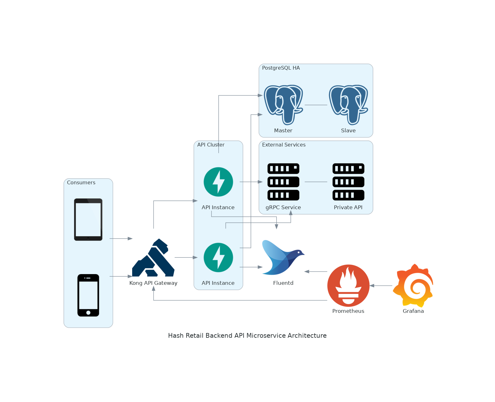

# Hash Hiring Challenge - E-Commerce Backend API

This repository contains an implementation of the hiring challenge given by
[Hash](https://www.hash.com.br/) for backend developers.

The challenge asks for an e-commerce HTTP (JSON) API that should expose a POST endpoint
for checking out a cart with products in it. A JSON file with 6 products and attributes 
were given to use as reference for the development.

A set of rules were given, they are as follows:

1. For each product a discount may be given by a gRPC service hosted on a docker container.
   The developer can use the .proto file given to generate a client to consume it.

2. If the discount service is unavailable, the checkout endpoint should continue working
   as if no discount were given.

3. The API should give a free product (labeled with a specific attribute) as a
   gift on Black Friday holiday. The criteria for this is up to the developer.

4. There must be only one gift entry in the cart.

5. Use of docker is mandatory, docker-compose is preferable.

Further information can be found at the
[Company's challenge github page](https://github.com/hashlab/hiring/tree/master/challenges/pt-br/new-backend-challenge).


## Developed Solution

For constructing the API, the following technologies were used:

- [Python](https://www.python.org/): Python is an interpreted, dynamically typed and garbage-collected
  high-level programming language and one of the most popular nowadays. It is commonly used for 
  web and API development since many operations are bottlenecked by IO operations and not held by
  the interpreted nature of the language.
- [FastAPI Framework](https://fastapi.tiangolo.com/): FastAPI is a web framework for
  building APIs with ease in a concise, clear and efficient way. It includes most of
  the commonly used features by packaging external tools with it, such as data validation
  with Pydantic, automatic documentation using Swagger/ReDoc with OpenAPI 3.0 specification,
  support for asynchronous code and many others. It provides all of  this while making most
  of the features/tools optional, providing flexibility and performance.
- [PostgreSQL Database](https://www.postgresql.org/): PostgreSQL is a relational open source
  database ready for production workloads. When dealing with structured data, SQL databases
  are usually preferred due to better query performance and data integrity, and PostgreSQL
  is one of the most mature tools available.
- [SQLAlchemy](https://www.sqlalchemy.org/): SQLAlchemy is an Object Relational Mapper (ORM)
  package for Python, used to interact with PostgreSQL and create models for manipulation.
- [Pytest](https://docs.pytest.org/en/stable/): Pytest is a test framework for Python that
  aims to be clear, concise and modular. Compared to unittest, it is less verbose and has
  additional features such as html report generation, parallel execution, parameterization
  and labeling, etc.
- [Docker](https://www.docker.com/): Docker is a platform for building, sharing and running
  containerized software applications. With Docker, we are able to create an isolated environment
  with the bare minimum installed dependencies for running our application, giving us reproducibility
  and control over how to deploy it.
- [Docker Compose](https://docs.docker.com/compose/): Docker Compose is a tool to define
  and run multi-container Docker application with a YAML configuration file, setting up
  all components of the application in a controlled and configurable environment.


## How to run

To run the implemented solution, first make sure that the following tools are installed on your system:

- Docker and Docker Compose
- Python 3.8 (I recommend [pyenv](https://github.com/pyenv/pyenv) for managing python versions)
- Git

### Cloning the project

First of all, clone this git repository with

```
❯ git clone https://github.com/rfayan/hash_retail.git
```

This will create a folder in you current directory with the repository contents inside.


### Setting up Python and its dependencies

Inside the project folder, the `.python-version` specifies that our desired Python version is 3.8. 
There are multiple ways and tools to help you with this, choose what's best for you.

If you are using [pyenv](https://github.com/pyenv/pyenv) you can easily install it with
`pyenv install 3.8.11`, and after that it should automatically detect and change to the correct version.

Check that you have the correct version:
```
❯ python --version
Python 3.8.11
```

After installing the correct Python version, the next step is creating a virtual environment to avoid
messing up our system packages and environment. We will do this by running

```
❯ python -m venv env
```

This will create a folder called `env` which will contain our project dependencies and will serve as
a virtual environment for us while working on this. We can activate it by doing

```
❯ source env/bin/activate
```

And verify if it is active by looking at the path returned with

```
❯ which python
/home/rfayan/Coding/hash-retail/env/bin/python
```

If the path ends with `env/bin/python` everything is working as expected.

Lastly, we need to install the project dependencies, they are listed in `Pipfile` and `Pipfile.lock`
and are managed using [Pipenv](https://pipenv.pypa.io/en/latest/). Pipenv can be installed using the
package manager of your distro or even pip itself, by running

```
❯ pip install pipenv
```

Afterwards, we need will install the package in Pipfile with

```
❯ pipenv install --dev
```

After one or two minutes, all python dependencies should be installed.


### Running with Docker and Docker-Compose

Before running the application, we will need to bring up our gRPC service and PostgreSQL database
using docker-compose and docker containers. You should have those installed using your distro's
package manager.

On the project root folder, check the contents of the file `.env.sample`. It contains reasonable values for
the variables that we will be using to run the solution.

Copy the sample file with

```
❯ cp .env.sample .env
```

and change its values as desired.

The last step is running docker-compose to build and start our service containers as defined in `docker-compose.yml`.

```
❯ docker-compose up -d
```

This command may take a while on the first run due to needing to pull the images from DockerHub and building our
own image for the first time (posterior builds should be faster due to image layers and multi-stage builds).
The status of the Docker containers can be queried with `docker container ls`.

After a while, go to your browser on localhost:8000 (or any other port you may have chosen), and you should
be redirected to an interactive Swagger documentation containing the API description and its endpoints!


### Populating the PostgreSQL Database with Products

At first, a GET request to /products will return an empty list and a POST to /store/checkout will always
return 404 NOT FOUND. This is because there are no products in the database yet.
To insert the products given in the challenge description, while postgreSQL is running, you can either

- Run ```make populate-db```
  - This will call a specific target in the `Makefile` and execute the commands below
- Run ```export `cat .env` && python populate_db.py```
  - This will export the environment variables inside `.env` to the current shell and execute populate_db.py

The first option, using Makefile, does the exact same thing, it is there for convenience.
The Makefile also has other targets that may be helpful, you can list them by running `make` in the terminal.

With that, we are ready to consume the checkout endpoint. You can do this via the Swagger documentation,
[Postman](https://www.postman.com/), [httpie](https://httpie.io/) or 
even curl itself with [JQ parser](https://stedolan.github.io/jq/).

```
❯ curl -X 'POST' \
  'http://localhost:8000/store/checkout' \
  -H 'accept: application/json' \
  -H 'Content-Type: application/json' \
  -d '{
  "products": [
    {
      "id": 1,
      "quantity": 5
    },
    {
      "id": 3,
      "quantity": 4
    }
  ]
}' | jq
{
  "total_amount": 317209,
  "total_amount_with_discount": 313420,
  "total_discount": 3789,
  "products": [
    {
      "id": 1,
      "quantity": 5,
      "unit_amount": 15157,
      "total_amount": 75785,
      "discount": 3789,
      "is_gift": false
    },
    {
      "id": 3,
      "quantity": 4,
      "unit_amount": 60356,
      "total_amount": 241424,
      "discount": 0,
      "is_gift": false
    }
  ]
}
```


## Running Unit Tests

Some unit tests were written using [pytest](https://docs.pytest.org/en/stable/).
There is a target in the Makefile that runs pytest using [coverage](https://coverage.readthedocs.io/en/stable/).

```
❯ make test
```

This will execute the test suite in the folder `tests` in the project root directory, show the
pytest execution results and print a coverage report.


## Example Microservice Architecture


